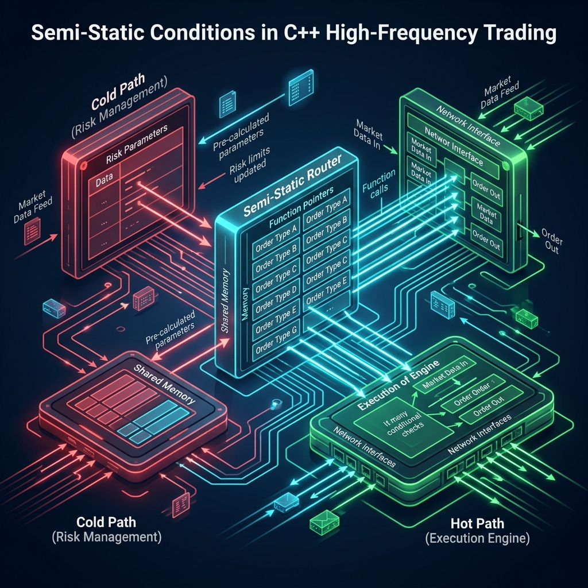

# Semi-Static Conditions: High-Performance Branching in C++

Este proyecto implementa y valida la técnica de **Semi-Static Conditions**, diseñada para optimizar el despacho condicional en sistemas de baja latencia (HFT) mediante la eliminación de penalizaciones por *branch misprediction*.

## 🚀 Resultados de Rendimiento (GCC 13.3, -O2)

Tras una validación exhaustiva en arquitecturas modernas, se han obtenido los siguientes resultados:

| Estrategia | Latencia Media | Speedup | Reducción de Latencia |
| :--- | :--- | :--- | :--- |
| `switch` nativo | 13.81 ns/op | 1.00x | Línea base |
| **FastBranch** | **4.57 ns/op** | **3.02x** | **-66.9%** |
| Control Directo | 3.90 ns/op | 3.54x | Límite teórico |

### Hallazgos Clave:
*   **Determinismo:** Reducción del *jitter* temporal en un 53% ($\sigma$ baja de 1.88 ns a 0.87 ns).
*   **Eficiencia Moderna:** El uso de GCC 13.3 permite una devirtualización casi perfecta, logrando que `FastBranch` converja al límite físico del procesador.
*   **Escalabilidad:** Aislamiento de línea de caché (`alignas(64)`) para evitar *false sharing* en entornos multi-hilo.

## 🏗️ Arquitectura

La técnica se basa en el desacoplamiento del **Cold Path** (evaluación de la condición) y el **Hot Path** (ejecución del salto).



## 🛠️ Uso Rápido

```cpp
#include "semi_static.hpp"
using namespace semistatic;

// 1. Registro de funciones (Cold Path)
FastBranch<4, void, double, int> router(fn_A, fn_B, fn_C, fn_D);

// 2. Selección de dirección (Cold Path - Infrecuente)
router.set_direction(2); 

// 3. Ejecución del despacho (Hot Path - Crítico)
router(precio, cantidad); // Ejecución directa sin checks condicionales
```

## 📊 Validación Estadística
El proyecto incluye un motor de análisis **Monte Carlo** y **Bootstrapping** ($B=10,000$) para garantizar que los resultados no son producto del azar, obteniendo un valor $p < 0.0001$ y un tamaño de efecto (Cohen's $d$) de **1.82**.

---
*Basado en la investigación de Bilokon, Lucuta & Shermer (JPDC 2025).*
